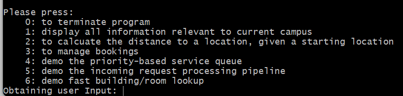
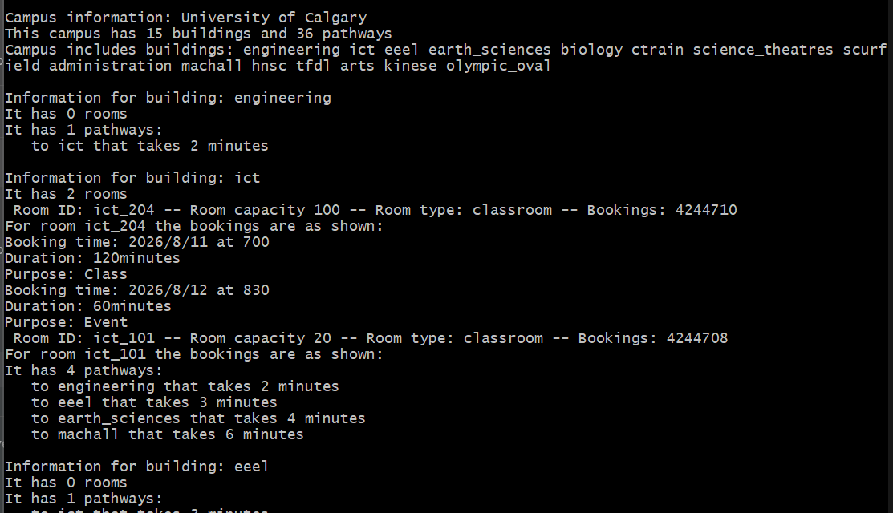
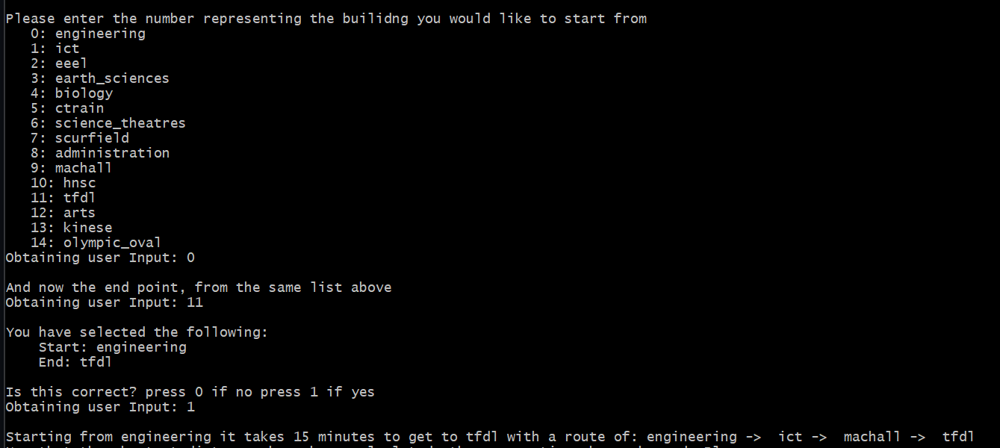
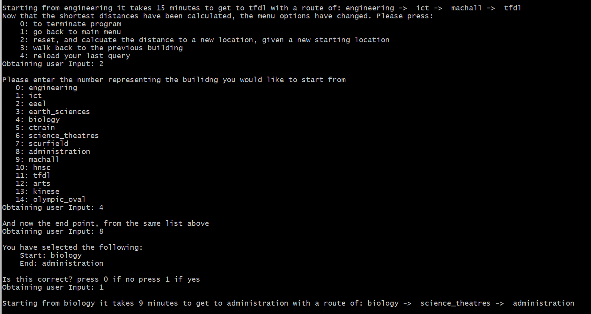
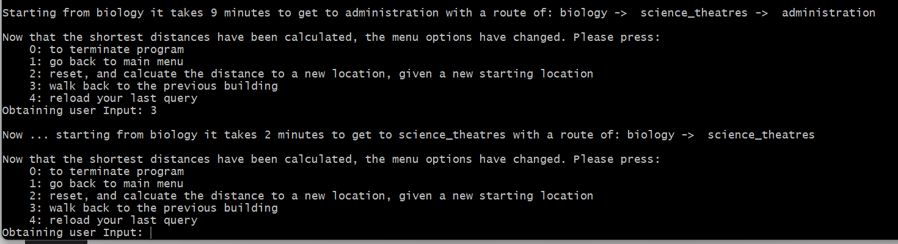
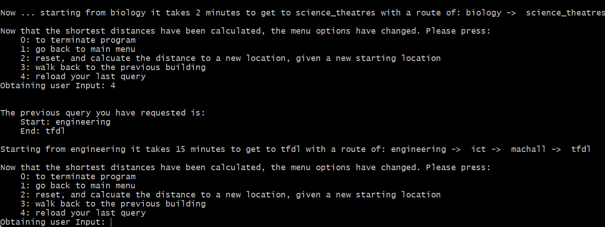
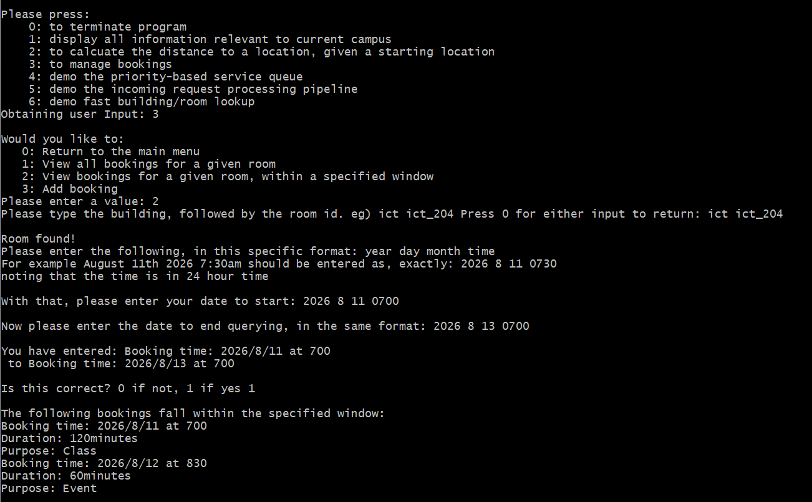
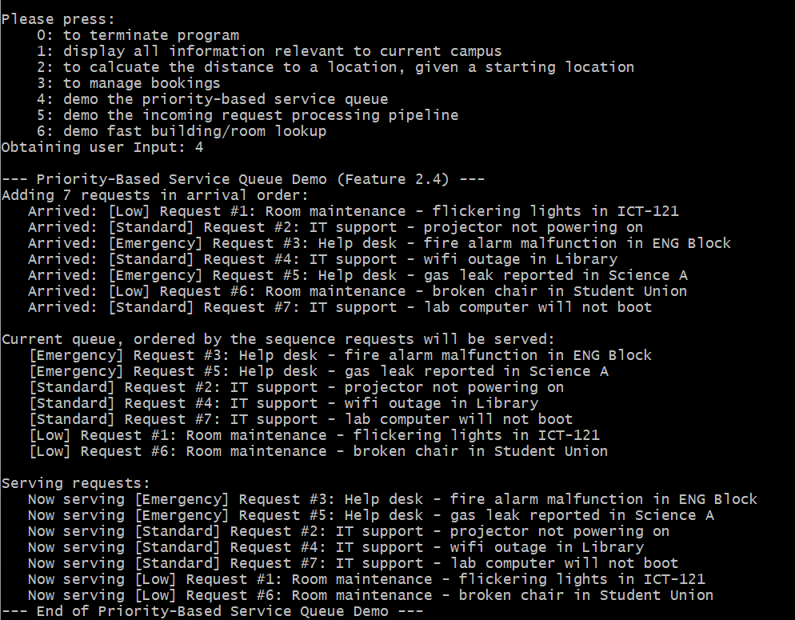
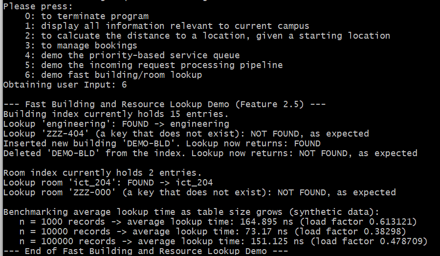
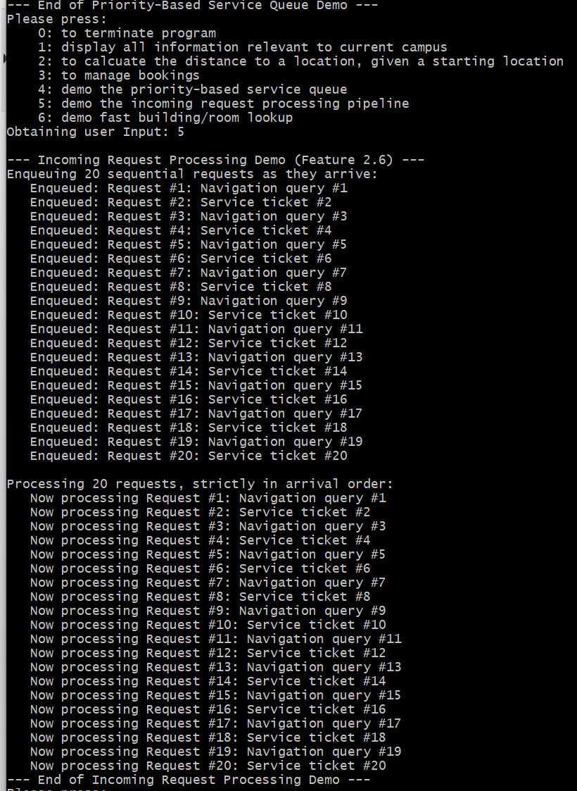

# ENSF-694-Final-Project
# THIS README HAS BEEN ARCHIVED. PLEASE SEE THE REPORT.PDF TITLED 'FINAL_GODIN_BOWERSOCK-KAMAL.PDF'

## Instructor: Maan Khedr

## Dylan Bowersock, Eric Godin, and Zohara Kamal

### Available at:
[https://github.com/dbowersock18/ENSF-694-Final-Project.git](https://github.com/dbowersock18/ENSF-694-Final-Project.git)

### Introduction
This project, and corresponding repository, addresses the problems outlined in "ENSF694 Term Project Guidelines.pdf" found within the repository. These problems are as followed:
1. Create and navigate (via a shortest distance algorithm) a Campus environment
2. Allow and manage the booking of rooms within the Campus
3. Create and process requests that simulate a service Queue and priority Queue
4. Maintain fast lookup and balancing in all aspects
   

The team has addressed these problems via all of the cpp & h files within the repository. 
1. CNEMS.cpp is functionally, the entry point into the program and the Client Interface
2. Building.cpp/h, Campus.cpp/h, Hashtable.cpp/h, Room.cpp/h, Request.cpp/h, Roombooking.cpp/h, AVL.cpp/h, and graph.cpp/h are all custom created classes/objects that programatically solve these isses
3. All text files, including RoomBooking.txt, RoomInformation.txt, and CampusMap.txt, serve as input files to load the information required for the program to run. eg) CampusMap.txt is a list of all the campus buildings and it's corresponding pathways.

### Instructions to run the application:
- To start the program, please run the "a.exe" file found in the repository.
- The entry point to the program will be a menu with several options. These options are directly related to the project problems and desired outcomes.
- Navigation is only integer input (for the different text options) and input of strings specific to buildings and rooms. NOTE, input other than what is expected may crash the program; it was assummed the user interacts with the program as intended.    

### Campus Layout
The below image is a visual representation of the campus layout used for this project. There is a total of 16 buildings and 36 pathways. Note that from each building, visually it looks like there is only 1 path way but, from a implementation perspective, there is two; one going and one returning. The building count and pathways is calculated computationally in the program.    

### Demo Scenarios and Screenshots
#### Printing information
The screenshot below demonstrates the output when the user selects the option to display information regarding the campus. New buildings, rooms, and bookings can be added quite easily, and at volume, using the text files

#### Shortest Path Query 2.1
When the user selects the shortest path query, they are prompted with a list of buildings and asked to provide the start and end location. After a quick verification the input is correct, the user is given the pathway between the start and end locations, and the distance/time to and from. The algorithm behind this is discussed in the design decisions section below.    

Resetting the query and selecting another option    

#### Undo Navigation 2.2
If a user would like to undo the path they can either: 
Walk back to the previous buliding    

Or, reload the last query completely    

#### Booking range query 2.3
Going back to the main menu, the user has other options as well. One of them is to manage bookings; specifically to look up when a building has a booking!
   

#### Priority Que Demo 2.4
An important component of a campus is being able to address different requests, with different priority levels. An example of this program accomplishing that is below.
  

#### Fast Lookup Demo 2.5
Another important component of this program is being able to obtain information quickly and efficiently. The screenshot below demonstrates such.
  

#### Request Pipeline Demo 2.6
Finally, the screenbelow demonstrates at least 10 requests being enqueued and dequed in arrival order.

#### Balanced Event Index (Bonus)
- TOOD: Eric to complete

### Design Decisions
- Shortest Path: The algorithm for the shortest path was chosen to be dijkstra's algorithm. This algorithm was chosen, partly because of famaliarity, but also because of efficacy. By utilizing a 'greedy' approach to node selection we can quickly search and compute our shortest distance on the campus. This approach requires a non-negative weight (or distance/time) but given we are calculating lengths amongst a campus pathway, this is a non issue. Dijkstar's algorithm intristically is a tree data structure as it only visits a node once (from a parent mode) and contains no cycles. This was chosen over other data structures, like a breath-first search, because the shortest path algorithm, in this specific situation, required it to be weighted and non-negative.

### Complexity Analysis

### Challenges and Lessons

### Contributions

### Use of AI
  - TODO: Dylan add portion on his use of AI
  - TOOD: Zohara add portion on her use of AI

